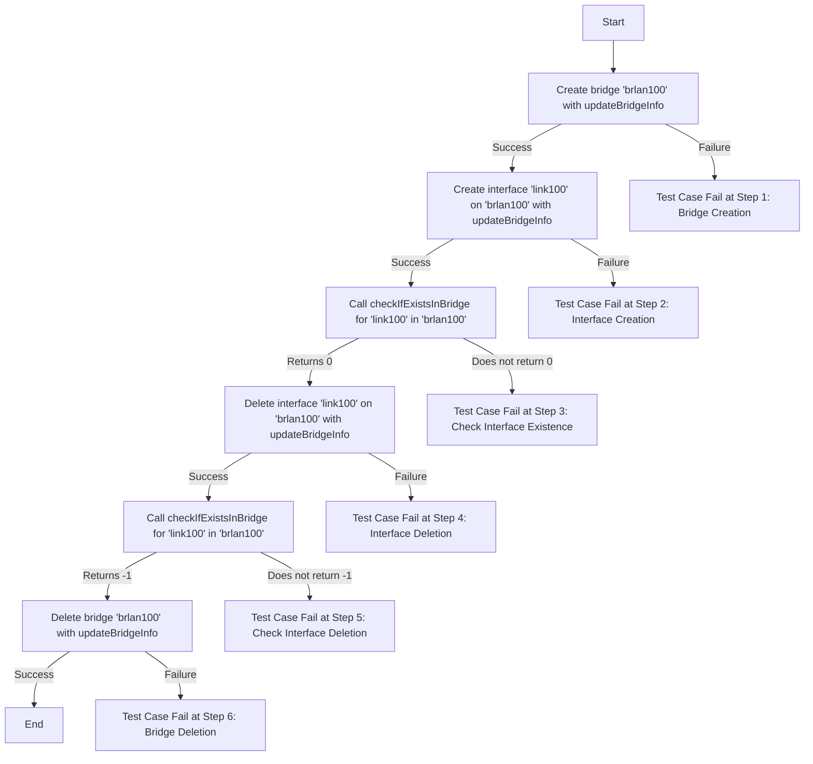
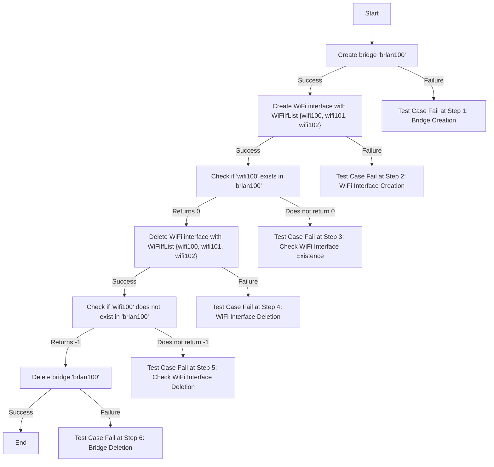
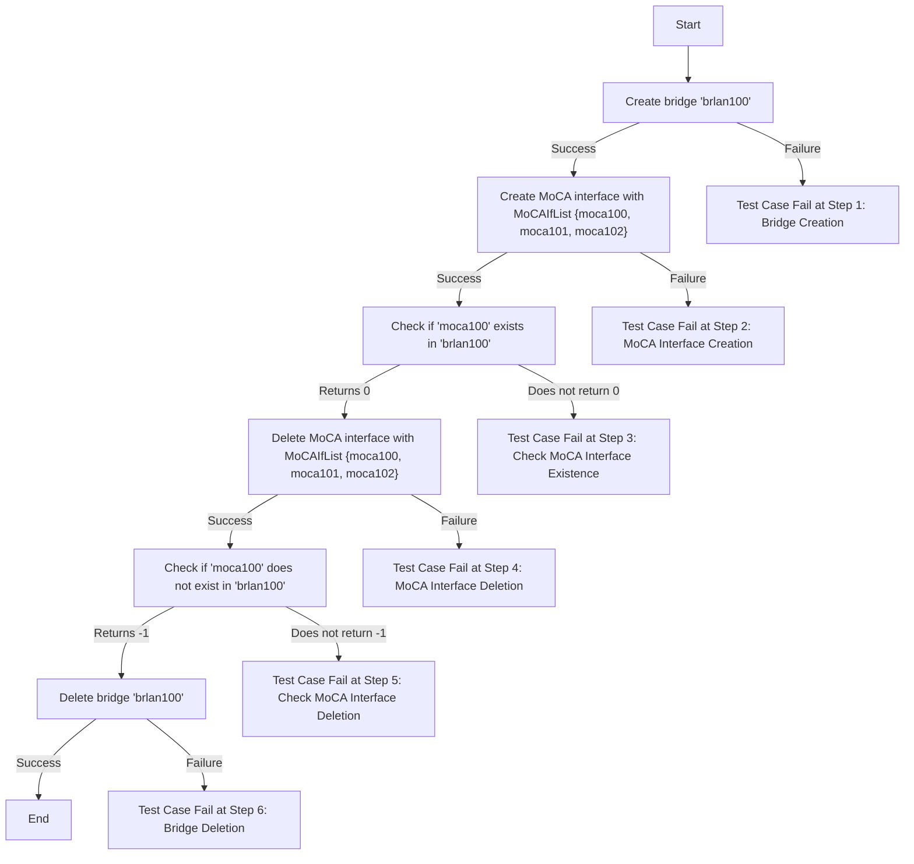
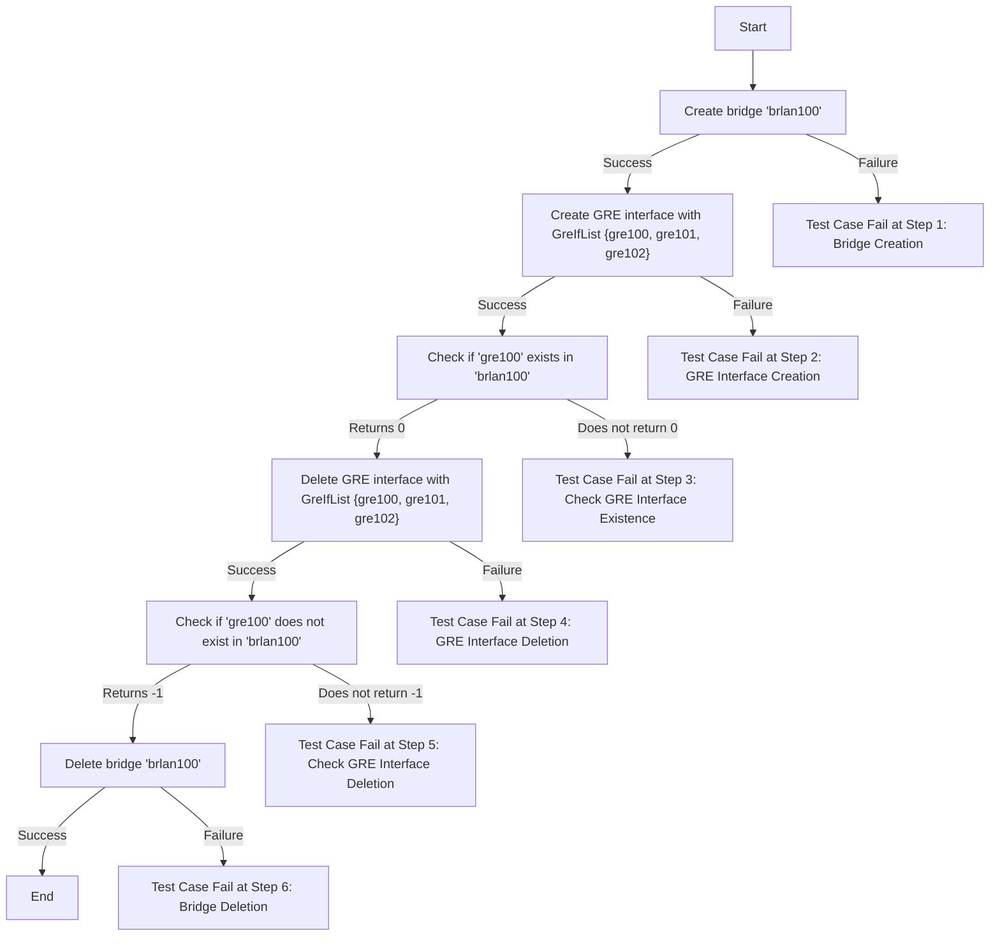
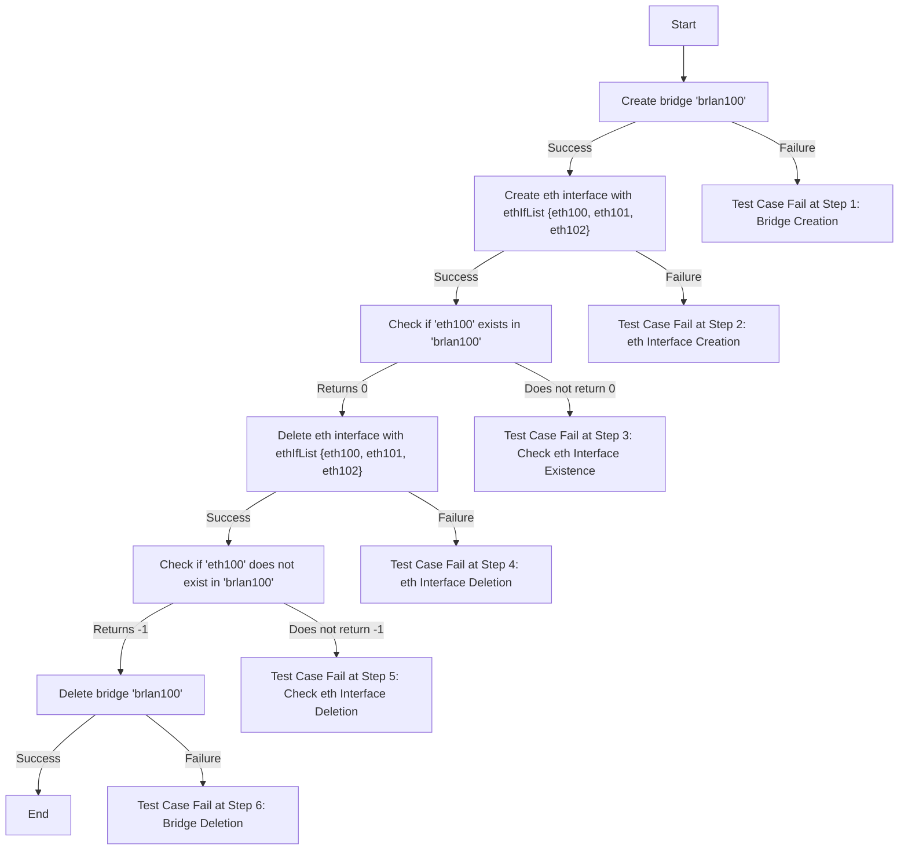

Please find the mermaid flow of Bridge Util L2 Test cases:

### Test Function Name : test_l2_bridge_util_hal_updateAndCheckInBridge_IF_VLAN_Type

### Test Function Name : test_l2_bridge_util_hal_updateAndCheckInBridge_IF_WIFI_Type

### Test Function Name : test_l2_bridge_util_hal_updateAndCheckInBridge_IF_MOCA_Type

### Test Function Name : test_l2_bridge_util_hal_updateAndCheckInBridge_IF_GRE_Type

### Test Function Name : test_l2_bridge_util_hal_updateAndCheckInBridge_IF_ETH_Type

