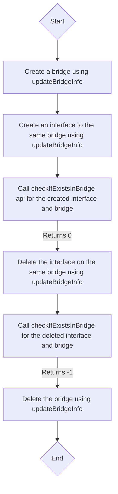
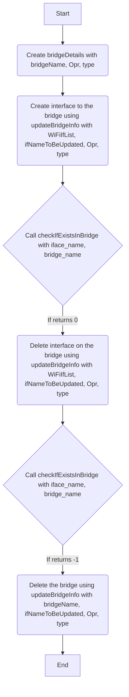
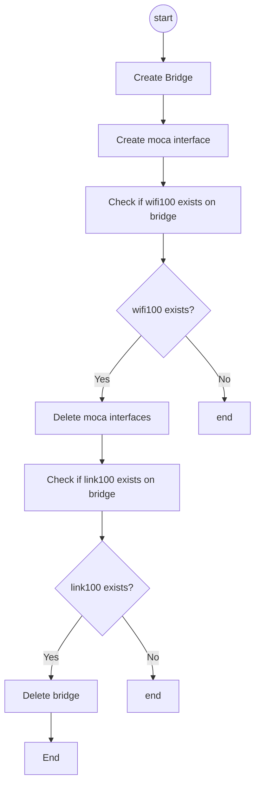
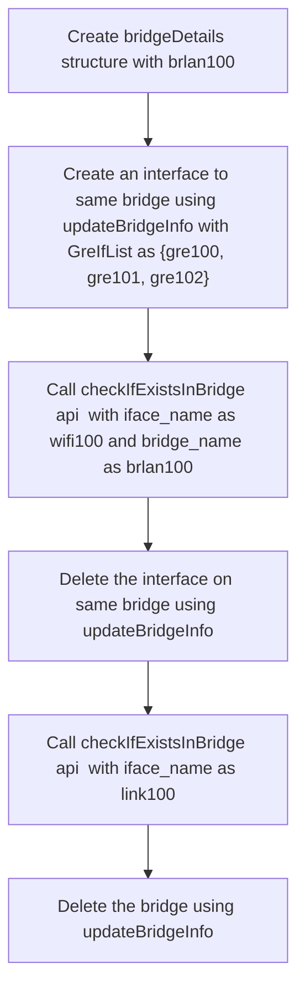
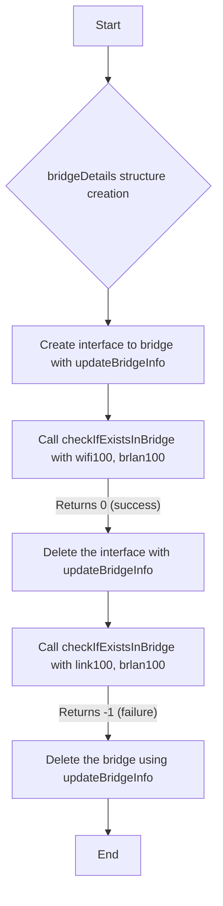

Please find the mermaid flow of Bridge Util L2 Test cases:

### Test 1

```mermaid
graph TB
A{Start} --> B[Create a bridge using updateBridgeInfo]
B --> C[Create an interface to the same bridge using updateBridgeInfo]
C --> D[Call checkIfExistsInBridge api for the created interface and bridge]
D --> |Returns 0| E[Delete the interface on the same bridge using updateBridgeInfo]
E --> F[Call checkIfExistsInBridge for the deleted interface and bridge]
F --> |Returns -1| G[Delete the bridge using updateBridgeInfo]
G --> H{End}
```

### Test 2

```mermaid
graph TB
A[Start] --> B(Create bridgeDetails with bridgeName, Opr, type)
B --> C(Create interface to the bridge using updateBridgeInfo with WiFiIfList, ifNameToBeUpdated, Opr, type)
C --> D{Call checkIfExistsInBridge with iface_name, bridge_name}
D -- If returns 0 --> E(Delete interface on the bridge using updateBridgeInfo with WiFiIfList, ifNameToBeUpdated, Opr, type)
E --> F{Call checkIfExistsInBridge with iface_name, bridge_name}
F -- If returns -1 --> G(Delete the bridge using updateBridgeInfo with bridgeName, ifNameToBeUpdated, Opr, type)
G --> H[End]
```

### Test 3

```mermaid
graph TB
start((start)) --> step1[Create Bridge]
step1 --> step2[Create moca interface]
step2 --> step3[Check if wifi100 exists on bridge]
step3 --> cond1{wifi100 exists?}
cond1 --Yes--> step4[Delete moca interfaces]
cond1 --No -->Step8[end]
step4 --> step5[Check if link100 exists on bridge]
step5 --> cond2{link100 exists?}
cond2 --Yes--> step6[Delete bridge]
cond2 --No --> Step9[end]
step6 --> step7[End]
```

### Test 4

```mermaid
graph TD
A["Create bridgeDetails structure with brlan100"] 
B["Create an interface to same bridge using updateBridgeInfo with GreIfList as {gre100, gre101, gre102}" ] 
C["Call checkIfExistsInBridge api  with iface_name as wifi100 and bridge_name as brlan100"] 
D["Delete the interface on same bridge using updateBridgeInfo "]
E["Call checkIfExistsInBridge api  with iface_name as link100"]
F["Delete the bridge using updateBridgeInfo"]
A --> B
B --> C
C --> D
D --> E
E --> F
```

### Test 5

```mermaid
graph TD
A[Start] --> B{bridgeDetails structure creation}
B --> C["Create interface to bridge with updateBridgeInfo"]
C --> D["Call checkIfExistsInBridge with wifi100, brlan100"]
D --> |"Returns 0 (success)"| E["Delete the interface with updateBridgeInfo"]
E --> F["Call checkIfExistsInBridge with link100, brlan100"]
F --> |"Returns -1 (failure)"| G["Delete the bridge using updateBridgeInfo"]
G --> H[End]
```
